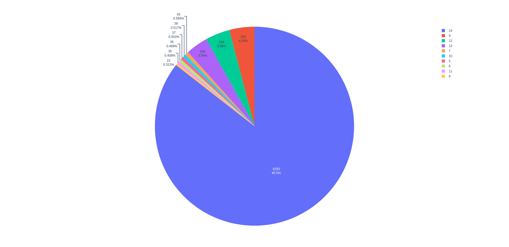
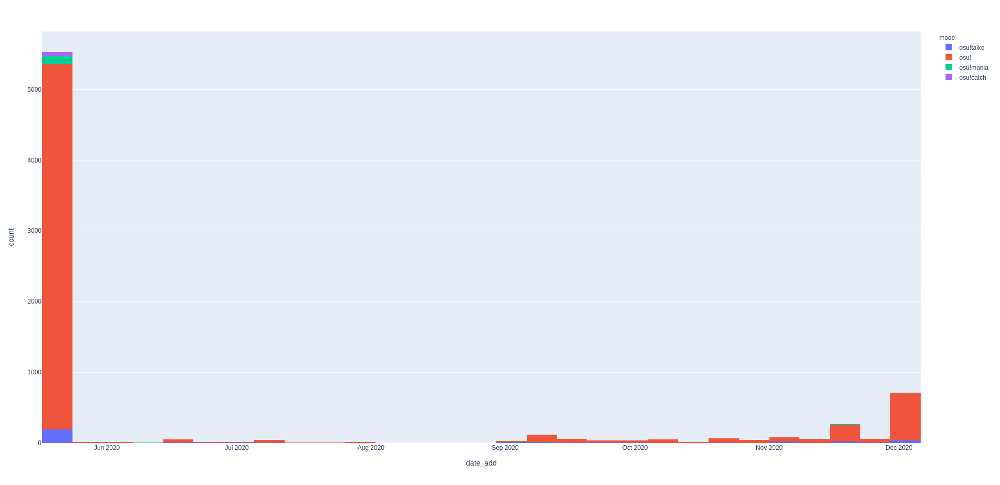

# OsuData

[](https://app.codacy.com/gh/LostPy/OsuData?utm_source=github.com&utm_medium=referral&utm_content=LostPy/OsuData&utm_campaign=Badge_Grade)

[](https://app.codacy.com/gh/LostPy/OsuData?utm_source=github.com&utm_medium=referral&utm_content=LostPy/OsuData&utm_campaign=Badge_Grade)

A small framework to work or vizualise osu! beatmaps data.
This framework use object-oriented programming (OOP) to easily manage beatmap data.
You can use `export` and `info` modules to work without object-oriented programming.

## Index <a id="index"></a>
  1. [Global informations](#globalInfos)

  2. [Features](#features)
      * [Completed](#completed)
      * [Coming soon](#comingSoon)

  3. [Documentation](#documentation)
      * [Structure](#structure)

      * [Basic use](#basicUse)
        * [Command line](#commandLine)
        * [Export](#export)
        * [Info](#info)
    
      * [Advanced use](#advancedUse)
        * [Beatmap](#beatmap)
        * [MusicOsu](#musicOsu)

  4. [Table of functions](#tableFunctions)
      * [Functions](#tableFunctions1)
      * [Methods class](#tableFunctions2)


## Global informations <a id="globalInfos"></a>
  * Author: LostPy

  * Version: 1.0
  
  * statement: in progress...

  * requirements:
    * [Python 3.x][py]
    * [colorama][color] (for logs, you can replace logs by print)
    * [pydub][pydub]
    * [numpy][np]
    * [pandas][pd]
    * [plotly][plotly]

  * Utility link:
    * [osu! .osu file format][osu_format]
    * [osu! .db file format][osu_db_format]

## Features <a id="features"></a>
### Completed <a id="completed"></a>
  * Base Features
    * Read beatmaps data
    * Read music data
    * Export data in a csv or a excel file
  
  * Stats Graphs
    * Stats version_fmt
    * Stats date add

  * Other
    * Play the music of a osu beatmaps folder

### Coming soon <a id="commingSoon"></a>
  * Base Features

  * Stats Graphs
    * Stats difficulties (HP, OD, CS, AR)
    * Number of beatmaps in function of time
    * Stats of an Artist
    * Stats of a Creator
    * Stats of time beatmaps

## Documentation <a id="documentation"></a>
### Structure <a id="structure"></a>
```
OsuData
└─── express
|      __init__.py
|      export.py
|      info
|
└─── osuDataClass
|      __init__.py
|      beatmap.py
|      musicOsu.py
|      beatmapError.py
|
└───__init__.py
└─── script.py
```

### basic use (without OOP) <a id="basicUse"></a>
This section explain `export` and `info` modules and the `script` file.

#### Command line <a id="commandLine"></a>
With `script.py` you can visualize someone stats of osu_folder, export all beatmaps from osu! folder in a csv file or xlsx file, and visualize Dataframe of a beatmap or beatmaps from a folder.
  1. Open your favourite console

  2. Go to OsuData's directory : `cd C:/path/of/OsuData`

  3. Execute `script.py` file with Python 3 : `python3 script.py` or `python.exe script.py`

  4. You can se :
  ```
  What do you want to do ?
    1- Read osu! folder and export datas in csv
    2- Read osu! folder and export datas in excel
    3- Read beatmaps of a folder and display datas
    4- Read a beatmap and display datas.
    5- Play the music of a osu folder
    6- [Other answer] stop the program.
    Answer: 
  ```
  Choose the action and answer the other questions

  5. Expects the programme to finish, if the action is a export in csv or xlsx file, the save path is print at the end.

#### Export <a id="export"></a>
  * `export.to_csv` <a id="exportToCsv"></a>
    * **Description:** Basic function to export a folder containing beatmaps in *csv* file. Use `osu_to_csv` to export all beatmaps from osu folder.

    * **Arguments:**
      * `folderpath`: *str* - The path of folder with beatmaps to export in csv
      * (`csv_path`): *str* - path of save, default: current folder.

    * **Return:** *str* - csv path

    ```py
    from OsuData import express

    dataframe = express.to_csv('C:/osu!/Songs/a_folder_path/')
    ```

  * `export.to_excel` <a id="exportToExcel"></a>
    * **Description:** Like `to_csv` but export in *xlsx* file. Use `osu_to_excel` to export all beatmaps from osu folder.

    * **Arguments:**
      * `folderpath`: *str* - The path of folder with beatmaps to export in csv
      * (`excel_path`): *str* - path of save, default: current folder.
      * (Other arguments): You can use keywords arguments to pass at `to_excel` function of [pandas][pdToExcel].

    * **Return:** *str* - Excel path

    ```py
    from OsuData import express

    dataframe = express.to_excel('C:/osu!/Songs/a_folder_path/')
    ```

  * `export.mp3_to_wav` <a id="mp3ToWav"></a>
    * **Description:** Export a mp3 file in a wav file with [pydub][pydub]

    * **Arguments:**
      * `mp3_path`: *str* - The path of mp3 file to export in wav file.
      * (`wav_file`): *str*, default: current path - The path of wav file to save.

    * **Return:** *str* - wav path

    ```py
    from OsuData import express

    wav_path = express.mp3_to_wav('C:/osu!/Songs/a_folder_path/audio.mp3')
    ```

  * `export.from_beatmap` <a id="fromBeatmap"></a>
    * **Description:** Export [beatmap data][metadata] in [DataFrame][pdDf] (one line).

    * **Arguments:**
      * `filepath`: *str* - path of the beatmap

    * **Return:**
      * *(True, DataFrame)* if there is not error in beatmap file.
      * *(False, beatmap_path)* if there is a error in beatmap file, beatmap_path is a *str*.

    ```py
    from OsuData import express

    valid, dataframe = express.from_beatmap('C:/osu!/Songs/a_folder_path/a_beatmap.osu')
    ```

  * `export.from_folder` <a id="fromFolder"></a>
    * **Description:** Export beatmaps data from a folder in [DataFrame][pdDf].

    * **Arguments:**
      * `folderpath`: *str* - path of the folder containing a beatmap or more

    * **Return:** *tuple(DataFrame, list)* - (dataframe, errors) with errors the list of beatmap path where a error was found.

    ```py
    from OsuData import express

    dataframe, errors = express.from_folder('C:/osu!/Songs/a_folder_path/')
    ```

  * `export.from_osu` <a id="fromOsu"></a>
    * **Description:** Export all beatmaps data from osu! folder in [DataFrame][pdDf].

    * **Arguments:**
      * `folderpath`: *str* - path of osu! folder

    * **Return:** *tuple(DataFrame, list)* - (dataframe, errors) with errors the list of beatmap path where a error was found.

    ```py
    from OsuData import express

    dataframe, errors = express.from_osu('C:/osu!/')
    ```

  * `export.osu_to_csv` <a id="osuToCsv"></a>
    * **Description:** Export all beatmaps data from osu folder in a csv file.

    * **Arguments:**
      * `osu_path`: *str* - The osu folder path.
      * (`csv_path`): *str*, default: current path - path where the csv file is save.
      * (`display_progress`): *bool*, default: True - if True, the progress is display in console with a progress bar and path of folders.

    * **Return:** *str* - path of csv file.

    ```py
      from OsuData import express

      csv_path = express.osu_to_csv('C:/osu!/')
    ```

  * `export.osu_to_excel` <a id="osuToExcel"></a>
    * **Description:** Like `osu_to_csv` but export in a xlsx file.

    * **Arguments:**
      * `osu_path`: *str* - The osu folder path.
      * (`excel_path`): *str*, default: current path - path where the excel file is save.
      * (`display_progress`): *bool*, default: True - if True, the progress is display in console with a progress bar and path of folders.
      * (Other arguments): You can use keywords arguments to pass at `to_excel` function of [pandas][pdToExcel].

    * **Return:** *str* - path of excel file.

    ```py
      from OsuData import express

      excel_path = express.osu_to_excel('C:/osu!/')
    ```

#### Info <a id="info"></a>
  * `info.global_info` <a id="globalInfo"></a>

  * `info.version_fmt` <a id="versionFormat"></a>
    * **Description:** Display a [Pie Chart](https://plotly.com/python/pie-charts/) to show the distribution of [version format][osu_format] of [beatmaps](#beatmap).

    * **Arguments:**
      * `dataframe`: *pandas.DataFrame* - A dataframe with a column 'version_fmt'.

    * **Return:** none

    ```py
      from OsuData import express

      df, errors = express.from_osu('C:/osu!/')
      express.version_fmt(df)
    ```
    A distribution example for version_format
    

  * `info.difficulties` <a id="Difficulties"></a>

  * `info.time` <a id="time"></a>

  * `info.date_add` <a id="dateAdd"></a>
    * **Description:** Display a Histogram to show the number of beatmaps add by period.

    * **Arguments:**
      * `dataframe`: *pandas.DataFrame* - A [dataframe][pdDf] with datetime index and a column 'mode'.

    * **Return:** none

    ```py
      from OsuData import express

      df, errors = express.from_osu('C:/osu!/')
      express.date_add(df)
    ```
    ]

  * `info.beatmap_data` <a id="beatmapData"></a>

  * `info.folder_data` <a id="folderData"></a>

  * `info.osu_data` <a id="osuData"></a>

  * `info.play_music` <a id="playMusic"></a>
    * **Description:** Play the music of a folder song or a [MusicOsu](#musicOsu) instance

    * **Arguments:**
      * (`folder_path`): *str* - path of osu! folder song
      * (`musicosu`): *MusicOsu* - A [MusicOsu](#musicOsu) instance

    * **Return:** none

    ```py
      from OsuData import express

      express.play_music('C:/osu!/Songs/osu_folder_song')
    ```

### Advanced use <a id="advancedUse"></a>
Use the OOP to work with beatmap or music folder (group of beatmap with a music) like objects.
To easily create a Beatmap object or a MusicOsu object, use :
```py
from OsuData.osuDataClass import Beatmap, MusicOsu

# To create a Beatmap object
beatmap = Beatmap.from_file('C:/osu!/Songs/folder_song/a_beatmap.osu')

# To create a MusicOsu object
musicosu = MusicOsu.from_folder('C:/osu!/Songs/folder_song/')
```
#### Beatmap <a id="beatmap"></a>
Class to represent a beatmap with this data.
`class OsuData.osuDataClass.beatmap.Beatmap`  
To import this class, you can use `from OsuData.osuDataClass import Beatmap`.

##### Attributes
For more information, you can check the [osu! file format][osu_format] on the osu!wiki.

Attribute name | Type | Description | Default value
-------------- |:----:| ----------- |:-------------:
`path` | *str* | path of beatmap file |
`valid` | *bool* | boolean to indicate if the beatmap is not initialize or if there is a error in beatmap file. | False
`name` | *str* | Name of beatmap, equivalent at `Title` in [osu file][metadata] | None
`version_fmt` | *int* | The [version of beatmap file][structure] | None
`countdown` | *int* | Speed of the [countdown][general] before the first hit object (0 = no countdown, 1 = normal, 2 = half, 3 = double) | 1
`mode` | *int* | [Game mode of the beatmap][general] (0 = osu!, 1 = osu!taiko, 2 = osu!catch, 3 = osu!mania) | 0
`creator` | *str* | The [creator][metadata]'s username of the beatmap | None
`time` | *int* | Time of the beatmap in ms | 0
`diffname` | *str* | The difficulty name, equivalent of "version" in [osu file][metadata] | None
`stars` | *float* | The global difficulty stat | 0
`difficulties` | *dict* | Dictionnaty with the [differents stats][difficulty] of a beatmap (`HP`, `OD`, `CS`, `AR`, `SliderMultiplier`, `SliderTickRate`) | None
`hitobjects_data` | *pandas.DataFrame* | A dataframe with all [hit-ojects][hit-objects] | None

##### Methods
  * `Beatmap.metadata` <a id="beatmapMetadata"></a>
    * **Description:** Return [metadata][metadata] in a dictionary. 

    * **Arguments:** none

    * **Return:** *dict* - The dictionary with [metadata][metadata] of the beatmap.

    ```py
    from OsuData.osuDataClass import Beatmap

    beatmap = Beatmap.from_file('C:/osu!/Songs/folder_song/a_beatmap.osu')
    metadata = beatmap.metadata()
    ```

  * `Beatmap.load` <a id="beatmapLoad"></a>
    * **Description:** Initialize [metadata][metadata] (attributes) of the beatmap.

    * **Arguments:**
      (`lines`): *list*, default: None - List of line (*str*) of beatmap file whithout `\n` char
      (`hitobjects`): *bool*, default: True - if `True` initalize also `hitobjects_data` attribute.

    * **Return:** none

    ```py
    from OsuData.osuDataClass import Beatmap

    beatmap = Beatmap('C:/osu!/Songs/folder_song/a_beatmap.osu')
    beatmap.load()
    ```

  * `Beatmap.load_hitobjects` <a id="beatmapHitobjects"></a>
    * **Description:** Initialize `hitobjects_data` attribute.

    * **Arguments:**
      * (`lines`): *list*, default: None - List of line (*str*) of beatmap file whithout `\n` char
    
    * **Return:** none

    ```py
    from OsuData.osuDataClass import Beatmap

    beatmap = Beatmap('C:/osu!/Songs/folder_song/a_beatmap.osu')
    beatmap.load_hitobjects()
    ```

  * `Beatmap.to_dataframe` <a id="beatmapToDataframe"></a>
    * **Description:** Export [metadata][metadata] of the beatmap object in a dataframe.

    * **Arguments:** none
    
    * **Return:** *pandas.DataFrame* - A [dataframe][pdDf] with metadata.

    ```py
    from OsuData.osuDataClass import Beatmap

    beatmap = Beatmap.from_file('C:/osu!/Songs/folder_song/a_beatmap.osu')
    beatmap.to_dataframe()
    ```

  * `Beatmap.from_file` <a id="beatmapFromFile"></a>
    * **Description:** A StaticMethod. Create a instance of `Beatmap` with a filepath.

    * **Arguments:**
      * `filepath`: *str* - The path of beatmap file.
    
    * **Return:**: *Beatmap* - A beatmap already initialize.

    ```py
    from OsuData.osuDataClass import Beatmap

    beatmap = Beatmap.from_file('C:/osu!/Songs/folder_song/a_beatmap.osu')
    ```

##### Supported Operations
  * Comparison operators : Compare two beatmaps with the attribute `stars`
  * `len(a)`: Return value of attribute `time`
  * `str(a)`: Return the str of [DataFrame][pdDf] representation of metadata.


#### MusicOsu <a id="musicOsu"></a>
Class to represent a folder of beatmaps with a same song with this data.
`class OsuData.osuDataClass.musicOsu.MusicOsu`  
To import this class, you can use `from OsuData.osuDataClass import MusicOsu`.

##### Attributes

Attribute name | Type | Description | Default value
-------------- |:----:| ----------- |:-------------:
`folderpath` | *str* | The path of song folder with beatmaps |
`music_path` | *str* | The path of mp3 file | None
`title` | *str* | [Title][metadata] of music/beatmaps | None
`artist` | *str* | The [artist name][metadata] of the music| None
`beatmaps` | *list* | The list of `Beatmap` objects| [ ]
`errors` | *list* | The list of beatmap path (str) where there is a error in beatmap file| [ ]
`ratio_error` | *float* | The error rate in this folder (1. = all beatmap files have a error)| 0.
`date_add` | *datetime.Datetime* | The date of creation of the folder | None

##### Methods
  * `MusicOsu.append`  <a id="musicOsuAppend"></a>
    * **Description:** Add a [beatmap][#beatmap] in the list of beatmaps.

    * **Atributes:**
      * `beatmap`: *Beatmap* - The [beatmap](#beatmap) to add

    * **Return:** none

    ```py
    from OsuData.osuDataClass import Beatmap, MusicOsu

    beatmap = Beatmap.from_file('C:/osu!/Songs/folder_song/a_beatmap.osu')
    musicosu = MusicOsu.from_folder('C:/osu!/Songs/other_folder_song/')
    musicosu.append(beatmap)
    ```

  * `MusicOsu.pop`  <a id="musicOsuPop"></a>
    * **Description:** Delete and return a [beatmap](#beatmap)

    * **Atributes:**
      * `index`: *int*, default `-1` - Index of [beatmap](#beatmap) to delete.

    * **Return:** `Beatmap` - The [beatmap](#beatmap) instance delete.

    ```py
    from OsuData.osuDataClass import MusicOsu

    musicosu = MusicOsu.from_folder('C:/osu!/Songs/folder_song/')
    beatmap = musicosu.pop()
    ```

  * `MusicOsu.metadata`  <a id="musicOsuMetadata"></a>
    * **Description:** Return metadata of MusicOsu instance in a dictionary

    * **Atributes:** none

    * **Return:** *dict* - A dictionary with metadata of MusicOsu instance.

    ```py
    from OsuData.osuDataClass import MusicOsu

    musicosu = MusicOsu.from_folder('C:/osu!/Songs/folder_song/')
    metadata = musicosu.metadata()
    ```

  * `MusicOsu.keys`  <a id="musicOsuKeys"></a>
    * **Description:** Return Attributes name of MusicOsu object

    * **Atributes:** none

    * **Return:** *list* - List of attributes names (*str*).

    ```py
    from OsuData.osuDataClass import MusicOsu

    musicosu = MusicOsu.from_folder('C:/osu!/Songs/folder_song/')
    attributes = musicosu.keys()
    ```

  * `MusicOsu.values`  <a id="musicOsuValues"></a>
    * **Description:** Return Attributes value of MusicOsu object

    * **Atributes:** none

    * **Return:** *list* - List of attributes value.

    ```py
    from OsuData.osuDataClass import MusicOsu

    musicosu = MusicOsu.from_folder('C:/osu!/Songs/folder_song/')
    values = musicosu.values()
    ```

  * `MusicOsu.items`  <a id="musicOsuItems"></a>
    * **Description:** Return tuples with first index the key and the second index the value.

    * **Atributes:** none

    * **Return:** *list* - List of tuple with a couple `(key, value)`

    ```py
    from OsuData.osuDataClass import MusicOsu

    musicosu = MusicOsu.from_folder('C:/osu!/Songs/folder_song/')
    items = musicosu.items()
    ```

  * `MusicOsu.load`  <a id="musicOsuLoad"></a>
    * **Description:** Initialize the MusicOsu instance by loading the [beatmaps](#beatmap) of the folder. 

    * **Atributes:**
      * (`modes`): *list*, default `[0, 1, 2, 3]` - List of int wich represent [beatmap modes][metadata] to load

    * **Return:** none

    ```py
    from OsuData.osuDataClass import MusicOsu

    musicosu = MusicOsu('C:/osu!/Songs/folder_song/')
    musicosu.load()
    ```

  * `MusicOsu.to_dataframe`  <a id="musicOsuToDataframe"></a>
    * **Description:** Export MusicOsu object in a `pandas.DataFrame`

    * **Atributes:** none

    * **Return:** *pandas.DataFrame* - The dataframe with all [beatmaps](#beatmap) [metadata][metadata].

    ```py
    from OsuData.osuDataClass import MusicOsu

    musicosu = MusicOsu.from_folder('C:/osu!/Songs/folder_song/')
    df = musicosu.to_dataframe()
    ```

  * `MusicOsu.dataframe_hitobjects`  <a id="musicOsuDataFrameHitobjects"></a>
    * **Description:** Export [hit-objects][hit-objects] data of all [beatmaps](#beatmap) of MusicOsu object in a `pandas.DataFrame`

    * **Atributes:** none

    * **Return:** *pandas.DataFrame* - The dataframe of [hit-objects][hit-objects] data

    ```py
    from OsuData.osuDataClass import MusicOsu

    musicosu = MusicOsu.from_folder('C:/osu!/Songs/folder_song/')
    df_hitobjects = musicosu.dataframe_hitobjects()
    ```

  * `MusicOsu.to_csv`  <a id="musicOsuToCsv"></a>
    * **Description:** Export all [beatmaps](#beatmap) [metadata][metadata] of MusicOsu object in a csv file.

    * **Atributes:**
      * (`path`): *str*, default `None` - Path where the csv file is save, by default, it's in current path.

    * **Return:** *str* - the path where the file is save.

    ```py
    from OsuData.osuDataClass import MusicOsu

    musicosu = MusicOsu.from_folder('C:/osu!/Songs/folder_song/')
    musicosu.to_csv()
    ```

  * `MusicOsu.to_excel`  <a id="musicOsuToExcel"></a>
    * **Description:** Like `to_csv` method but export in a xlsx file.

    * **Atributes:**
      * (`path`): *str*, default `None` - Path where the xlsx file is save, by default, it's in current path.
      * (`sheetname`): *str*, default `''` - The name of sheet to create in xlsx file.
      * (Other arguments): You can use keywords arguments to pass at `to_excel` function of [pandas][pdToExcel].

    * **Return:** *str* - the path where the file is save.

    ```py
    from OsuData.osuDataClass import MusicOsu

    musicosu = MusicOsu.from_folder('C:/osu!/Songs/folder_song/')
    musicosu.to_excel()
    ```

  * `MusicOsu.mp3_object`  <a id="musicOsuMp3Object"></a>
    * **Description:** Load the mp3 file of MusicOsu instance in a `pydub.MP3` instance.

    * **Atributes:** none

    * **Return:** *pydub.MP3* - The [mp3 instance][pydub] of the mp3 file of MusicOsu.

    ```py
    from OsuData.osuDataClass import MusicOsu

    musicosu = MusicOsu.from_folder('C:/osu!/Songs/folder_song/')
    mp3 = musicosu.mp3_object()
    ```

  * `MusicOsu.to_wav`  <a id="musicOsuToWav"></a>
    * **Description:** Export the mp3 file in a wav file.

    * **Atributes:**
      * `name`: *str*, default `audio_wav` - The name of wav file.

    * **Return:** *str* - The path where the wav file is save (The folder of MusicOsu instance).

    ```py
    from OsuData.osuDataClass import MusicOsu

    musicosu = MusicOsu.from_folder('C:/osu!/Songs/folder_song/')
    wav_path = musicosu.to_wav()
    ```

  * `MusicOsu.data_music`  <a id="musicOsuDataMusic"></a>
    * **Description:** Extract audio data of the mp3 file.

    * **Atributes:** none

    * **Return:** (*int*, *list*) - The [rate and AudioData][pydub] from mp3 file.

    ```py
    from OsuData.osuDataClass import MusicOsu

    musicosu = MusicOsu.from_folder('C:/osu!/Songs/folder_song/')
    rate, audData = musicosu.data_music()
    ```

  * `MusicOsu.music_to_dataframe`  <a id="musicOsuMusicToDataframe"></a>
    * **Description:** Export mp3 file from MusicOsu instance in a [`pandas.DataFrame`][pdDf].

    * **Atributes:** none

    * **Return:** *pandas.DataFrame* - The dataframe of mp3 file data, with 2 columns [L, R]

    ```py
    from OsuData.osuDataClass import MusicOsu

    musicosu = MusicOsu.from_folder('C:/osu!/Songs/folder_song/')
    df_music = musicosu.music_to_dataframe()
    ```

  * `MusicOsu.play_music` <a id="musicOsuPlay"></a>
    * **Description:** A method to play the music of MusicOsu instance.

    * **Atributes:** none

    * **Return:** none

    ```py
    from OsuData.osuDataClass import MusicOsu

    musicosu = MusicOsu.from_folder('C:/osu!/Songs/folder_song/')
    musicosu.play_music()
    ```

  * `MusicOsu.from_folder` <a id="musicOsuFromFolder"></a>
    * **Description:** `Staticmethod` - Create and initialize a MusicOsu instance with a folder path of a folder song with beatmaps.

    * **Atributes:**
      * `folderpath`: *str* - The path of folder song with beatmaps.
      * `modes`: *list* - List of int wich represent beatmaps mode to load.
    * **Return:** *musicOsu.MusicOsu* - The MusicOsu instance loaded.

    ```py
    from OsuData.osuDataClass import MusicOsu

    musicosu = MusicOsu.from_folder('C:/osu!/Songs/folder_song/')
    ```

##### Supported Operations
  * Comparison operators : Compare two beatmaps with the lenght of the attribute `beatmaps`
  * `beatmap in a`: Return True if `beatmap` instance is in MusicOsu `a`
  * `len(a)`: Return the lenght of the attribute `beatmaps`
  * `str(a)`: Return the str of [DataFrame][pdDf] representation of all beatmaps metadata.
  * `del(a[index])`: Delete the beatmap at `index` (in `beatmaps` list) from MusicOsu instance `a`
  * `a[index]`: Return the beatmap at `index`
  * `a[index] = beatmap`: insert `beatmap` at the index

## Table of functions <a id="tableFunctions"></a>
### Functions <a id="tableFunctions1"></a>
  * [Export](#export)
    * [`to_csv`](#exportToCsv)
    * [`to_excel`](#exportToExcel)
    * [`mp3_to_wav`](#mp3ToWav)
    * [`musicOsu_objects`](#musicOsuObjects)
    * [`from_beatmap`](#fromBeatmap)
    * [`from_folder`](#fromFolder)
    * [`from_osu`](#fromOsu)
    * [`osu_to_csv`](#osuToCsv)
    * [`osu_to_excel`](#osuToExcel)

  * [Info](#info)
    * [`global_info`](#globalInfo)
    * [`version_fmt`](#versionFormat)
    * [`difficulties`](#Difficulties)
    * [`time`](#time)
    * [`date_add`](#dateAdd)
    * [`beatmap_data`](#beatmapData)
    * [`folder_data`](#folderData)
    * [`osu_data`](#osuData)
    * [`play_music`](#playMusic)

### Methods class <a id="tableFunctions2"></a>
  * [`class beatmap.Beatmap`](#beatmap)
    * [`metadata`](#beatmapMetadata)
    * [`load`](#beatmapLoad)
    * [`load_hitobjects`](#beatmapHitobjects)
    * [`to_dataframe`](#beatmapToDataframe)
    * [`from_file`](#beatmapFromFile)

  * [`class musicOsu.MusicOsu`](#musicOsu)
    * [`append`](#musicOsuAppend)
    * [`pop`](#musicOsuPop)
    * [`metadata`](#musicOsuMetadata)
    * [`keys`](#musicOsuKeys)
    * [`values`](#musicOsuValues)
    * [`items`](#musicOsuItems)
    * [`load`](#musicOsuLoad)
    * [`to_dataframe`](#musicOsuToDataframe)
    * [`dataframe_hitobjects`](#musicOsuDataFrameHitobjects)
    * [`to_csv`](#musicOsuToCsv)
    * [`to_excel`](#musicOsuToExcel)
    * [`mp3_object`](#musicOsuMp3Object)
    * [`to_wav`](#musicOsuToWav)
    * [`data_music`](#musicOsuDataMusic)
    * [`music_to_dataframe`](#musicOsuMusicToDataframe)
    * [`play_music`](#musicOsuPlay)
    * [`from_folder`](#musicOsuFromFolder)


## Index
  1. [Global informations](#globalInfos)

  2. [Features](#features)
      * [Completed](#completed)
      * [Coming soon](#comingSoon)

  3. [Documentation](#documentation)
      * [Structure](#structure)

      * [Basic use](#basicUse)
        * [Command line](#commandLine)
        * [Export](#export)
        * [Info](#info)

      * [Advanced use](#advancedUse)
        * [Beatmap](#beatmap)
        * [MusicOsu](#musicOsu)

  4. [Table of functions](#tableFunctions)
      * [Functions](#tableFunctions1)
      * [Methods class](#tableFunctions2)


[py]: https://www.python.org/
[color]: https://pypi.org/project/colorama/
[pydub]: https://github.com/jiaaro/pydub
[np]: https://numpy.org/
[pd]: https://pandas.pydata.org/pandas-docs/stable/reference/api/pandas.DataFrame.to_excel.html?highlight=to_excel#pandas.DataFrame.to_excel
[pdDf]: https://pandas.pydata.org/docs/reference/api/pandas.DataFrame.html
[pdToExcel]: https://pandas.pydata.org/pandas-docs/stable/reference/api/pandas.DataFrame.to_excel.html
[plotly]: https://plotly.com/
[osu_format]: https://osu.ppy.sh/wiki/en/osu%21_File_Formats/Osu_%28file_format%29
[structure]: https://osu.ppy.sh/wiki/en/osu%21_File_Formats/Osu_%28file_format%29#structure
[general]: https://osu.ppy.sh/wiki/en/osu%21_File_Formats/Osu_%28file_format%29#general
[metadata]: https://osu.ppy.sh/wiki/en/osu%21_File_Formats/Osu_%28file_format%29#metadata
[difficulty]: https://osu.ppy.sh/wiki/en/osu%21_File_Formats/Osu_%28file_format%29#difficulty
[hit-objects]: https://osu.ppy.sh/wiki/en/osu%21_File_Formats/Osu_%28file_format%29#hit-objects
[osu_db_format]: https://osu.ppy.sh/wiki/en/osu%21_File_Formats/Db_%28file_format%29
